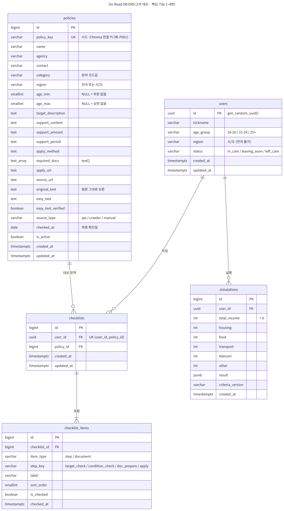

# DB 스키마 (On-Road)

> 범위: 1차 데모 핵심 기능 1~4번 (정책 검색, 쉬운 말 변환, 생활비 시뮬레이션, 신청 준비 체크리스트)

<br/>

## 1. DB 결정 사항

| 항목 | 결정 |
|---|---|
| DB | **PostgreSQL 16** |
| 벡터 검색 | **Chroma**. PostgreSQL에는 벡터를 저장하지 않음 |
| 로컬 실행 | Docker 이미지 `postgres:16` |
| 사용자 식별 | 로그인 없음. 온보딩 시 발급한 `user_id`(UUID)를 프론트가 로컬에 저장해 사용 |

**Chroma 연동 방식**
- 정형 데이터(정책·사용자·체크리스트·시뮬레이션)는 PostgreSQL, 원문 청크와 임베딩은 Chroma에 저장
- 두 저장소는 `policies.policy_key`로 연결. Chroma의 각 청크 메타데이터에 `policy_key`를 넣음
  - 내부 `id`(BIGSERIAL)는 DB를 다시 만들면 바뀔 수 있어 연결 키로 쓰지 않음
- 검색은 2단계로 처리
  1. PostgreSQL에서 서비스 노출 조건 + 연령/지역 필터로 후보 정책의 `policy_key` 목록 추출
  2. Chroma에서 메타데이터 필터(`policy_key` 후보 목록)를 걸고 벡터 유사도 검색
- 비활성화·미검증 정책은 1단계에서 빠지므로 Chroma에 청크가 남아 있어도 검색되지 않음. 정책 원문(`original_text`)이 바뀐 경우에만 A가 해당 정책을 다시 임베딩

<br/>

## 2. ERD



IE 표기법으로 작성했다. 부모·자식은 FK 기준으로 구분하며, FK를 가진 쪽이 자식이다.

| 부모 → 자식 | 연결 FK | 식별 여부 | 부모 쪽 | 자식 쪽 | 읽는 법 |
|---|---|---|---|---|---|
| `users` → `checklists` | `checklists.user_id` | 비식별 (점선) | 필수 1 | 선택 0..N | 사용자는 체크리스트가 없을 수도 있고, 체크리스트는 반드시 사용자 1명에 속한다 |
| `users` → `simulations` | `simulations.user_id` | 비식별 (점선) | 필수 1 | 선택 0..N | 사용자는 시뮬레이션 기록이 없을 수도 있고, 기록은 반드시 사용자 1명에 속한다 |
| `policies` → `checklists` | `checklists.policy_id` | 비식별 (점선) | 필수 1 | 선택 0..N | 정책은 체크리스트가 없을 수도 있고, 체크리스트는 반드시 정책 1개를 대상으로 한다 |
| `checklists` → `checklist_items` | `checklist_items.checklist_id` | 비식별 (점선) | 필수 1 | 필수 1..N | 체크리스트는 항목을 반드시 1개 이상 가지고, 항목은 반드시 체크리스트 1개에 속한다 |

- 모든 관계가 **비식별 관계**인 이유: 자식 테이블마다 자체 PK(`id`)가 있고, 부모 키는 PK가 아닌 일반 FK 컬럼으로 상속함
- 부모 쪽이 모두 **필수 1**인 이유: 모든 FK 컬럼이 `NOT NULL`
- `checklist_items`의 **1개 이상**은 DB 제약이 아니라 생성 규칙(3.4, step 항목 4개 자동 생성)으로 보장
- 컬럼별 제약·설명은 3장, 전체 DDL은 부록 참고

<br/>

## 3. 테이블 정의

### 3.1 `users` — 온보딩 사용자

| 컬럼 | 타입 | 제약 | 설명 |
|---|---|---|---|
| id | UUID | PK, 기본값 `gen_random_uuid()` | 온보딩 응답으로 반환하는 `user_id` |
| nickname | VARCHAR(20) | NOT NULL | 닉네임 |
| age_group | VARCHAR(10) | NOT NULL, 코드값 | 연령대 |
| region | VARCHAR(10) | NOT NULL, 코드값 | 거주 시/도 (`전국` 불가) |
| status | VARCHAR(20) | NOT NULL, 코드값 | 현재 상태 |
| created_at / updated_at | TIMESTAMPTZ | NOT NULL | |

- 순차 ID 대신 UUID를 쓰는 이유: 로그인이 없어 ID 자체가 식별자 역할을 하므로 추측하기 어려워야 함
- 회원정보 수정/삭제는 스코프 아웃이지만, 하위 테이블은 `ON DELETE CASCADE`로 연결해 둠

### 3.2 `policies` — 정책 정보 (정형 데이터)

| 컬럼 | 타입 | 제약 | 설명 |
|---|---|---|---|
| id | BIGSERIAL | PK | 내부 ID (API에서 `policy_id`) |
| policy_key | VARCHAR(20) | NOT NULL, UNIQUE | `policies.json`의 고유 키. 시드 upsert 기준, Chroma 연결 키 |
| name | VARCHAR(200) | NOT NULL | 정책명 |
| agency | VARCHAR(100) | NOT NULL | 담당기관 |
| contact | VARCHAR(200) | | 문의처 (전화번호 등) |
| category | VARCHAR(20) | NOT NULL, 코드값 | 분야. 시뮬레이션 관련 정책 연결에 사용 |
| region | VARCHAR(10) | NOT NULL, 코드값, 기본값 `전국` | `전국` 또는 시/도 |
| age_min | SMALLINT | NULL 허용 | 최소 나이(만). NULL = 하한 없음 |
| age_max | SMALLINT | NULL 허용 | 최대 나이(만). NULL = 상한 없음 |
| target_description | TEXT | NOT NULL | 지원 대상 및 자격 조건 (원문 기준 정리) |
| support_content | TEXT | NOT NULL | 지원 내용 |
| support_amount | TEXT | | 지원 금액 (예: "월 50만 원") |
| support_period | TEXT | | 지원 기간 |
| apply_method | TEXT | NOT NULL | 신청 방법 및 절차 |
| required_docs | TEXT[] | NOT NULL, 기본값 `{}` | 필요 서류 목록. 체크리스트 서류 항목 생성에 사용 |
| apply_url | TEXT | | 공식 신청 페이지 URL (체크리스트 신청 단계 버튼) |
| source_url | TEXT | NOT NULL | 공식 원문 URL |
| original_text | TEXT | NOT NULL | 정책 원문 전체 (가공 없이 보존) |
| easy_text | TEXT | | 쉬운 말 변환문 |
| easy_text_verified | BOOLEAN | NOT NULL, 기본값 false | 핵심조건 누락 검증 통과 여부 |
| source_type | VARCHAR(10) | NOT NULL, 코드값 | 수집 방식 |
| checked_at | DATE | NOT NULL | 최종 확인일 (답변 카드에 표시) |
| is_active | BOOLEAN | NOT NULL, 기본값 true | 비활성화 시 서비스 비노출 (삭제 대신 사용) |
| created_at / updated_at | TIMESTAMPTZ | NOT NULL | |

- **서비스 노출 조건**: `is_active = true AND easy_text_verified = true`
  - `easy_text_verified = true`이면 `easy_text`는 반드시 있어야 함 (CHECK 제약)
  - 근거: "검증 통과한 정책만 서비스에 노출" (개발 범위 문서, 쉬운말 검증 스크립트 4단계)
- 금액·기간은 표기 형태가 정책마다 달라(월/최대/1회 등) 숫자가 아닌 TEXT로 저장
- 오래된 자료 경고는 `checked_at` 기준으로 애플리케이션에서 계산 (기준 일수는 API 명세에서 정의)

### 3.3 `checklists` — 사용자별 정책 신청 준비 체크리스트

| 컬럼 | 타입 | 제약 | 설명 |
|---|---|---|---|
| id | BIGSERIAL | PK | |
| user_id | UUID | NOT NULL, FK → users.id, `ON DELETE CASCADE` | |
| policy_id | BIGINT | NOT NULL, FK → policies.id, `ON DELETE RESTRICT` | 정책은 삭제하지 않고 비활성화 |
| created_at / updated_at | TIMESTAMPTZ | NOT NULL | |

- `(user_id, policy_id)` UNIQUE → 한 사용자당 정책별 체크리스트 1개. "없으면 생성" API를 get-or-create로 구현하는 근거
- 진행률은 저장하지 않고 조회 시 계산: **체크된 step 항목 수 / 4**

### 3.4 `checklist_items` — 체크리스트 단계 및 서류 항목

| 컬럼 | 타입 | 제약 | 설명 |
|---|---|---|---|
| id | BIGSERIAL | PK | 토글 API의 `item_id` |
| checklist_id | BIGINT | NOT NULL, FK → checklists.id, `ON DELETE CASCADE` | |
| item_type | VARCHAR(10) | NOT NULL, 코드값 | `step`(단계) / `document`(서류) |
| step_key | VARCHAR(20) | NOT NULL, 코드값 | 소속 단계 |
| label | VARCHAR(200) | NOT NULL | 표시 문구 (단계명 또는 서류명) |
| sort_order | SMALLINT | NOT NULL | 표시 순서 |
| is_checked | BOOLEAN | NOT NULL, 기본값 false | |
| checked_at | TIMESTAMPTZ | | 체크 시각 |

**생성 규칙 (체크리스트 생성 시 1회)**
1. `step` 항목 4개 생성: 대상 확인 → 조건 확인 → 서류 준비 → 신청 (개발 범위 문서 기준 4단계)
2. 해당 정책의 `required_docs` 배열 요소마다 `document` 항목 생성 (`step_key = doc_prepare`)

- 서류 항목은 생성 시점의 `required_docs`를 **복사(스냅샷)** 해서 저장. 이후 정책 데이터가 바뀌어도 사용자 체크 기록이 깨지지 않음
- `document` 항목은 반드시 `doc_prepare` 단계 소속 (CHECK 제약)
- 한 체크리스트에 같은 단계의 `step` 항목은 1개만 (부분 UNIQUE 인덱스)
- 신청 URL은 저장하지 않고 `policies.apply_url`을 조인해서 반환
- `doc_prepare` 단계 체크와 서류 항목 체크는 **서로 독립**. 서류를 모두 체크해도 단계는 자동 체크되지 않고, 사용자가 직접 체크

**단계별 상세 설명 출처** (별도 저장 없이 `policies` 필드를 조회해서 반환)

| step_key | 상세 설명에 사용하는 필드 |
|---|---|
| `target_check` | `target_description` (쉬운 말 보기 시 `easy_text`) |
| `condition_check` | `target_description` + 연령/지역 판정 결과 (5장) |
| `doc_prepare` | `required_docs` (서류 항목) |
| `apply` | `apply_method`, `apply_url` |

### 3.5 `simulations` — 생활비 배분 시뮬레이션 결과

| 컬럼 | 타입 | 제약 | 설명 |
|---|---|---|---|
| id | BIGSERIAL | PK | |
| user_id | UUID | NOT NULL, FK → users.id, `ON DELETE CASCADE` | |
| total_income | INT | NOT NULL, > 0 | 월 소득/지원금 합계 (원) |
| housing | INT | NOT NULL, ≥ 0 | 주거비 |
| food | INT | NOT NULL, ≥ 0 | 식비 |
| transport | INT | NOT NULL, ≥ 0 | 교통비 |
| telecom | INT | NOT NULL, ≥ 0 | 통신비 |
| other | INT | NOT NULL, ≥ 0 | 기타 |
| result | JSONB | NOT NULL | 판정 결과 (아래 구조) |
| criteria_version | VARCHAR(20) | NOT NULL | 판정에 사용한 기준표 버전 |
| created_at | TIMESTAMPTZ | NOT NULL | |

- 배분 항목 5개는 주거비/식비/교통비/통신비/기타 1:1 대응
- **합계 = 소득** 을 DB CHECK 제약으로 강제 (프론트 검증과 별개로 서버에서도 보장)
- 기준표가 바뀌어도 과거 이력을 해석할 수 있도록 `criteria_version` 저장

**`result` JSONB 구조**
```json
{
  "shortages": [
    { "item": "housing", "input": 300000, "minimum": 400000, "gap": 100000 }
  ],
  "alternatives": [
    {
      "label": "식비를 줄여 주거비 보완",
      "allocations": { "housing": 400000, "food": 200000, "transport": 60000, "telecom": 40000, "other": 100000 },
      "remaining_shortages": []
    }
  ],
  "related_policy_ids": [3, 7]
}
```
- `alternatives`는 2~3개
- `related_policy_ids`는 부족 항목과 연결된 분야(category)의 노출 가능 정책

<br/>

## 4. 코드값 정의

모든 코드값은 PostgreSQL ENUM 대신 `VARCHAR + CHECK`로 관리 (값 추가 시 마이그레이션이 단순함)

| 컬럼 | 코드값 | 의미 |
|---|---|---|
| users.age_group | `18-20` / `21-24` / `25+` | 연령대 |
| users.status | `in_care` / `leaving_soon` / `left_care` | 시설생활 / 퇴소예정 / 퇴소후 |
| policies.category | `independence` / `housing` / `education` / `employment` / `living_cost` / `medical` / `finance` | 자립 / 주거 / 교육 / 취업 / 생활비 / 의료 / 금융 |
| policies.source_type | `api` / `crawler` / `manual` | API / 크롤러 / 수동 입력 |
| checklist_items.item_type | `step` / `document` | 단계 / 서류 |
| checklist_items.step_key | `target_check` / `condition_check` / `doc_prepare` / `apply` | 대상 확인 / 조건 확인 / 서류 준비 / 신청 |

**지역 코드 (시/도 17개 + 전국)**

`서울` `부산` `대구` `인천` `광주` `대전` `울산` `세종` `경기` `강원` `충북` `충남` `전북` `전남` `경북` `경남` `제주` `전국`

- 약칭을 쓰는 이유: 강원·전북처럼 정식 명칭이 바뀐 지역이 있어 표기 불일치를 막기 위함
- `전국`은 `policies.region`에만 허용, `users.region`에는 불가

<br/>

## 5. 조건 필터 규칙 (연령/지역)

필터 결과는 DB에 저장하지 않고 조회 시 계산한다. 결과는 **3상태**이며, "신청 가능"이라는 표현은 쓰지 않는다.

**연령대 → 나이 범위 매핑**

| age_group | 범위 |
|---|---|
| 18-20 | 18 ~ 20 |
| 21-24 | 21 ~ 24 |
| 25+ | 25 ~ 상한 없음 |

**판정**

| 조건 | 판정 |
|---|---|
| 사용자 연령 구간이 정책 나이 범위에 **완전히 포함** (NULL은 제한 없음으로 간주) | `match` |
| 구간이 정책 범위와 **일부만 겹침** | `needs_check` (조건 확인 필요) |
| 구간이 정책 범위와 **겹치지 않음** | `excluded` |
| 정책 지역이 `전국` 이거나 사용자 지역과 **일치** | `match` |
| 정책 지역이 사용자 지역과 **불일치** | `excluded` |

- 최종 판정: 하나라도 `excluded`면 제외 → 하나라도 `needs_check`면 `needs_check` → 모두 `match`면 `match`
- `excluded` 정책은 검색 후보에서 빠지고, `needs_check`는 결과에 포함하되 "조건 확인 필요"로 표시
- 예: `25+` 사용자 vs 만 18~27세 정책 → 25~27은 겹치고 28 이상은 벗어나므로 `needs_check`

<br/>

## 6. 시드 데이터 형식 (`data/policies/policies.json`)

`policies` 테이블 컬럼과 **키 이름을 동일하게** 맞춘다. 시드 스크립트는 `policy_key` 기준 upsert로 동작해 여러 번 실행해도 중복되지 않는다.

```json
[
  {
    "policy_key": "P001",
    "name": "자립수당",
    "agency": "보건복지부",
    "contact": "129",
    "category": "living_cost",
    "region": "전국",
    "age_min": null,
    "age_max": null,
    "target_description": "지원 대상 및 자격 조건 원문 정리",
    "support_content": "지원 내용",
    "support_amount": "월 OO만 원",
    "support_period": "보호종료 후 O년",
    "apply_method": "신청 방법 및 절차",
    "required_docs": ["신분증", "통장 사본"],
    "apply_url": "https://...",
    "source_url": "https://...",
    "original_text": "정책 원문 전체",
    "easy_text": null,
    "easy_text_verified": false,
    "source_type": "manual",
    "checked_at": "2026-09-28"
  }
]
```
- 위 값은 형식 예시이며 실제 내용은 D가 공식 출처 기준으로 작성
- 필수 키: `policy_key`, `name`, `agency`, `category`, `region`, `target_description`, `support_content`, `apply_method`, `required_docs`, `source_url`, `original_text`, `source_type`, `checked_at`
- 날짜는 `YYYY-MM-DD`, 코드값은 4장 기준

<br/>

## 7. 스코프 아웃 (1차 데모에 테이블 없음)

| 항목 | 비고 |
|---|---|
| 저장한 정책 (`saved_policies`) | 추가 기능 6·7번에서 필요. 착수 시 `(user_id, policy_id)` 테이블 1개 추가 |
| 정책 변경 이력·검수 상태 | 관리자 기능 스코프 아웃. 현재는 `is_active`, `checked_at`만 사용 |
| 퇴소 예정일 | 퇴소 시점 기준 자립 체크리스트가 스코프 아웃이라 미수집 |
| 소득·보호종료 여부 필터 | 1차 필터는 연령/지역만 적용 |
| 연령대별 쉬운 말 난이도 | 자립준비청년 단일 페르소나라 변환문 1종만 저장 |

<br/>

## 8. 협의 필요 사항

| 대상 | 내용 |
|---|---|
| D (데이터) | 6장 형식으로 `policies.json` 작성. `category`·`region`은 4장 코드값 사용 |
| D (데이터) | `simulation-criteria.json`에 항목별 기준값과 **배분 항목 → 정책 category 매핑** 포함 (예: `housing → housing`, `food → living_cost`), 버전 문자열 포함 |
| A (RAG) | Chroma 청크 메타데이터에 `policy_key` 필수 포함. RAG 함수 입력은 질문 + 후보 `policy_key` 목록, 출력은 답변 + 근거 스니펫 + 해당 `policy_key` + 근거 없음 여부 |
| A (RAG) / D | 검증 통과한 쉬운 말 변환문을 `easy_text`, `easy_text_verified`에 반영하는 방식 확정 (json 갱신 후 재시드 또는 스크립트 업데이트) |
| C (프론트) | 연령대 선택지가 `18-20 / 21-24 / 25+`로 확정인지 확인 (명세에 "등"으로 표기됨) |
| C (프론트) | 시뮬레이션 제출 조건 통일 필요. 명세에 "합계가 총소득과 **일치**해야 제출"과 "합계가 소득 **초과** 시 비활성화"가 같이 적혀 있음. DB는 **일치** 기준으로 설계 |

<br/>

## 부록. DDL

```sql
-- 사용자
CREATE TABLE users (
    id          UUID PRIMARY KEY DEFAULT gen_random_uuid(),
    nickname    VARCHAR(20) NOT NULL,
    age_group   VARCHAR(10) NOT NULL
                CHECK (age_group IN ('18-20', '21-24', '25+')),
    region      VARCHAR(10) NOT NULL
                CHECK (region IN ('서울','부산','대구','인천','광주','대전','울산','세종',
                                  '경기','강원','충북','충남','전북','전남','경북','경남','제주')),
    status      VARCHAR(20) NOT NULL
                CHECK (status IN ('in_care', 'leaving_soon', 'left_care')),
    created_at  TIMESTAMPTZ NOT NULL DEFAULT now(),
    updated_at  TIMESTAMPTZ NOT NULL DEFAULT now()
);

-- 정책
CREATE TABLE policies (
    id                  BIGSERIAL PRIMARY KEY,
    policy_key          VARCHAR(20)  NOT NULL UNIQUE,
    name                VARCHAR(200) NOT NULL,
    agency              VARCHAR(100) NOT NULL,
    contact             VARCHAR(200),
    category            VARCHAR(20)  NOT NULL
                        CHECK (category IN ('independence','housing','education','employment',
                                            'living_cost','medical','finance')),
    region              VARCHAR(10)  NOT NULL DEFAULT '전국'
                        CHECK (region IN ('전국','서울','부산','대구','인천','광주','대전','울산','세종',
                                          '경기','강원','충북','충남','전북','전남','경북','경남','제주')),
    age_min             SMALLINT,
    age_max             SMALLINT,
    target_description  TEXT NOT NULL,
    support_content     TEXT NOT NULL,
    support_amount      TEXT,
    support_period      TEXT,
    apply_method        TEXT NOT NULL,
    required_docs       TEXT[] NOT NULL DEFAULT '{}',
    apply_url           TEXT,
    source_url          TEXT NOT NULL,
    original_text       TEXT NOT NULL,
    easy_text           TEXT,
    easy_text_verified  BOOLEAN NOT NULL DEFAULT false,
    source_type         VARCHAR(10) NOT NULL
                        CHECK (source_type IN ('api', 'crawler', 'manual')),
    checked_at          DATE NOT NULL,
    is_active           BOOLEAN NOT NULL DEFAULT true,
    created_at          TIMESTAMPTZ NOT NULL DEFAULT now(),
    updated_at          TIMESTAMPTZ NOT NULL DEFAULT now(),
    CHECK (age_min IS NULL OR age_max IS NULL OR age_min <= age_max),
    CHECK (NOT easy_text_verified OR easy_text IS NOT NULL)
);

CREATE INDEX idx_policies_visible ON policies (category, region)
    WHERE is_active = true AND easy_text_verified = true;

-- 체크리스트
CREATE TABLE checklists (
    id          BIGSERIAL PRIMARY KEY,
    user_id     UUID   NOT NULL REFERENCES users(id) ON DELETE CASCADE,
    policy_id   BIGINT NOT NULL REFERENCES policies(id) ON DELETE RESTRICT,
    created_at  TIMESTAMPTZ NOT NULL DEFAULT now(),
    updated_at  TIMESTAMPTZ NOT NULL DEFAULT now(),
    UNIQUE (user_id, policy_id)
);

CREATE TABLE checklist_items (
    id            BIGSERIAL PRIMARY KEY,
    checklist_id  BIGINT NOT NULL REFERENCES checklists(id) ON DELETE CASCADE,
    item_type     VARCHAR(10) NOT NULL
                  CHECK (item_type IN ('step', 'document')),
    step_key      VARCHAR(20) NOT NULL
                  CHECK (step_key IN ('target_check', 'condition_check', 'doc_prepare', 'apply')),
    label         VARCHAR(200) NOT NULL,
    sort_order    SMALLINT NOT NULL,
    is_checked    BOOLEAN NOT NULL DEFAULT false,
    checked_at    TIMESTAMPTZ,
    CHECK (item_type = 'step' OR step_key = 'doc_prepare')
);

CREATE INDEX idx_checklist_items_checklist ON checklist_items (checklist_id);
CREATE UNIQUE INDEX uq_checklist_step ON checklist_items (checklist_id, step_key)
    WHERE item_type = 'step';

-- 시뮬레이션
CREATE TABLE simulations (
    id                BIGSERIAL PRIMARY KEY,
    user_id           UUID NOT NULL REFERENCES users(id) ON DELETE CASCADE,
    total_income      INT NOT NULL CHECK (total_income > 0),
    housing           INT NOT NULL CHECK (housing   >= 0),
    food              INT NOT NULL CHECK (food      >= 0),
    transport         INT NOT NULL CHECK (transport >= 0),
    telecom           INT NOT NULL CHECK (telecom   >= 0),
    other             INT NOT NULL CHECK (other     >= 0),
    result            JSONB NOT NULL,
    criteria_version  VARCHAR(20) NOT NULL,
    created_at        TIMESTAMPTZ NOT NULL DEFAULT now(),
    CHECK (housing + food + transport + telecom + other = total_income)
);

CREATE INDEX idx_simulations_user ON simulations (user_id, created_at DESC);
```

- `updated_at`은 애플리케이션(ORM)에서 갱신
- `gen_random_uuid()`는 PostgreSQL 13 이상 기본 제공 (별도 확장 불필요)
